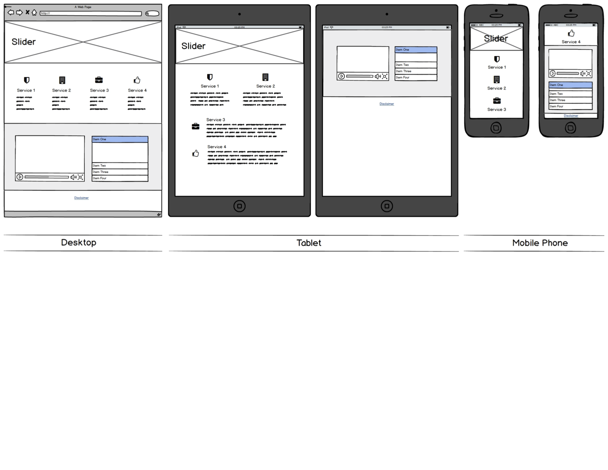

# Financial Advisor Landing Page Bootstrap Template 

### About
Tasked with designing and building a sleek and professional website representing a Financial Firm that targets individuals and families. 

### Requirements
Using Bootstrap was the main requirement for the project, as was following the wireframe design below:

### Additional Requirements that were explored: 
- Extra JQuery task: Use jQuery to add a description text just between the banner slider and the 4 icon columns (not on the wireframe)
- Use JQuery: when user clicks on the disclaimer link in the footer, please have some text show up in a browser alert window before opening that specific link. For this I ended up using a plugin from https://github.com/austenliao/bootstrap-alert so that I could make the default browser confirmation alert look a little nicer and still use JQuery to trigger the pop up. Otherwise default modals in BS would have been used. 

#### Wireframe

